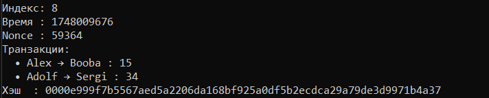
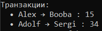

# 🧠 Техническое руководство: Блокчейн на Go

**Проект:** Вариативная часть проектной практики  
**Студенты:** Павленко Владислав Сергеевич | Фокин Павел Вячеславович  
**Группа:** 241-338

---

## 📌 Цель проекта

Создать минимально рабочую модель блокчейна на языке Go, включающую:

- структуру блока;
- транзакции;
- Proof-of-Work;
- сохранение/загрузку цепочки;
- CLI-интерфейс.

---

## ⚙️ Архитектура проекта

| Файл | Назначение |
|------|------------|
| `block.go` | Структура блока, майнинг |
| `blockchain.go` | Работа с цепочкой: создание, добавление, сохранение |
| `transaction.go` | Структура транзакций |
| `main.go` | CLI-запуск и демонстрация |


---

## 📦 Структура блока

Каждый блок содержит:

- порядковый номер (Index),
- метку времени (Timestamp),
- список транзакций,
- хэш предыдущего блока,
- собственный хэш,
- значение `Nonce`.

Блоки связаны друг с другом, формируя непрерывную цепочку. Нарушение даже одного хэша делает всю цепочку недействительной.

```go
type Block struct {
	Index        int
	Timestamp    int64
	Transactions []Transaction
	PrevHash     []byte
	Hash         []byte
	Nonce        int
}
```
---

## 🔁 Алгоритм Proof-of-Work

Чтобы блок нельзя было создать мгновенно, применяется механизм Proof-of-Work.  
Суть: блок считается «валидным» только если его хэш начинается с заданного количества нулевых байтов. Это количество задаётся параметром `difficulty`.

Для вычисления такого хэша программа перебирает значение `Nonce` до тех пор, пока не будет найден подходящий хэш. Чем выше сложность — тем больше попыток потребуется.

```go
prefix := bytes.Repeat([]byte{0}, difficulty)
if bytes.HasPrefix(b.Hash, prefix) { break }
```


---

## 💳 Транзакции

Транзакции — это передача условной «валюты» между двумя пользователями.  
Они включаются в блок до начала майнинга. Структура транзакции состоит из:

- отправитель (`From`);
- получатель (`To`);
- сумма (`Amount`).

Перед майнингом новый блок получает список транзакций, которые затем становятся его частью.

```go
	tx1 := bc.Transaction{From: "Alex", To: "Booba", Amount: 15}
	tx2 := bc.Transaction{From: "Adolf", To: "Sergi", Amount: 34}
	chain.AddBlock([]bc.Transaction{tx1, tx2})
```


---

## 💾 Сохранение и загрузка цепочки

Для сохранения цепочки используется сериализация в бинарный файл (`chain.gob`).  
Это позволяет:

- сохранять текущее состояние после завершения работы,
- загружать его при следующем запуске.

Если файл отсутствует — создаётся новый блок (генезис-блок), с начальными транзакциями от системы.

```go
chain := Load("chain.gob", difficulty)
...
chain.Save("chain.gob")
```

---

## 🖥 Интерфейс командной строки

Программа управляется через CLI. Основная команда:

```bash
go run main.go -difficulty 2